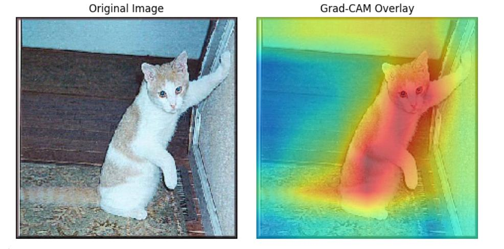

# GradCAM Overview
- Full form: Gradient based Class Activation Maps
- In this, we check which part in the feature maps is responsible (got activated/deactivated) for generating the target value (list of probabilities).
- For example, lets say its a CNN network for a cat vs dog dataset. Now our model predicted the image belonging to the cat class.
- Now we want to look at what all parts in the feature maps contributed in deciding that this image belongs to the cat class.
- Once we are able to locate those parts in the feature maps, we can project its receptive field on the original image by resizing the feature map to the image size.
- That way we can conclude that the model is looking at that projected part while making the decision.

## Process
- Pass the image through the fientuned ResNet50 network. Refer to the [gradCAM](./gradCAM.ipynb) notebook.
- Lets say the Ground Truth is Cat, and model prediction is also Cat.
- Generate the output feature map from the last convolution layer
    - Shape: 7 X 7 X 2048 (for example)
- Calculate the Gradient of the Cat class score with respect to each value in the feature maps.
    -  If the value is +ve -> it is contributing in increasing the cat score, and if it is -ve it is contributing to in reducing the cat score.
    - If the value is 0, it does not have any impact on the cat score
    - Shape of the Gradient is also: 7 X 7 X 2048
    ```python
    with tf.GradientTape() as tape:
    
        tape.watch(img_array)

        feature_maps = resnet_backbone(img_array)['5'] # (None, 7, 7, 2048)
        pooling = model.get_layer("global_average_pooling2d")(feature_maps)
        dropout = model.get_layer("dropout")(pooling, training=False)
        prediction = model.get_layer("dense")(dropout, training=False) # (None, 2)

        class_idx = 0 # Cat Index
        class_score = prediction[:,class_idx]
    
    grads = tape.gradient(class_score, feature_maps)
    ```
- After this, average out the gradient matrix along Rows and Columns
    - Shape: (2048,)
- Multiply the Feature Map with this averaged out gradient vector along the channel
    - Feature_Map[:,:,i] *= Grad_Vector[i]
- Average out the weighted Feature map along the channels
    - Shape: 7 X 7
- Normalize the weighted feature map by dividing with the max value and zero out the activations less than 0 for clear visibility on what all (and how much) activations that are actually contributing. 

```python
weighted_feature_maps = feature_maps[0] * tf.reduce_mean(grads, axis=(0,1,2))[tf.newaxis, tf.newaxis]
weighted_feature_maps = tf.reduce_mean(weighted_feature_maps, axis=(-1))
weighted_feature_maps = weighted_feature_maps.numpy()
weighted_feature_maps /= np.max(weighted_feature_maps)

heatmap = weighted_feature_maps
heatmap = tf.image.resize(heatmap[..., tf.newaxis], (224,224))
heatmap = tf.squeeze(heatmap)

colormap = plt.cm.get_cmap('jet')
heatmap_rgb = colormap(heatmap.numpy())

# Drop alpha channel, keep RGB
heatmap_rgb = heatmap_rgb[..., :3]
original_image = tf.cast(img_array, tf.float32) / 255.0

# Superimpose heatmap on original image
superimposed_img = 0.6 * heatmap_rgb + 0.4 * original_image[0].numpy()

original_image = tf.clip_by_value(original_image, 0.0, 1.0).numpy()
superimposed_img = tf.clip_by_value(superimposed_img, 0.0, 1.0).numpy()
```

- Resize the averaged out feature map to the actual image size, and overlay it on the  original image. Red part signifies where the model is focusing while making the decision. We can see that it is focusing on majority of cat body while classifying the image as Cat


## Why do we follow this approach
- Each conv layer output channel is like a semantic feature detector (e.g., "dog ears", "whiskers", "tail").
- So:
    - Compute the gradient of the class score w.r.t. each channel (shape 7×7) — this tells you where the feature mattered.
    - Average the gradient over the 7×7 spatial grid → you get a scalar importance weight for each channel.
    - These scalar weights are how important each feature is for the target class.
- Then you weight each channel’s activation map by its importance and average over channels → this gives the Grad-CAM heatmap.
- Why this works better:
    - If you just average gradients along channels returned it as a heatmap:
        - You mix up features of varying importance
        - You lose the ability to say “this type of feature is important”
        - You end up with a less interpretable and noisier map
- Intuition Recap:
    - Grad-CAM wants to answer: “Which semantic features mattered most for the decision, and where in the image were they active?”
    - Gradients tell us how important a feature is
    - Conv activations tell us where the feature was detected
    - Grad-CAM combines the two in a targeted, interpretable way

